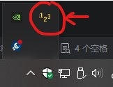

<h1>随时计数（演示版 v20260811.0）</h1>

- *演示版仅供演示，功能仍待完善。*
- *演示版尽可能地隐藏了一些未完成的部分，但仍有一部分未被未隐藏。*

一个让计数更轻松的工具。

# 快速开始

## 安装并启动

通过 PyPI 安装：
```shell
python -m pip install count-anywhere  # 安装
python -m count_anywhere  # 启动程序
```

## 基础操作

- 程序启动后，图标会出现在系统托盘里。
  

> 在执行以下步骤前请先**确保**你要知道：按下`ESC`键可以退出计数界面！
> 
> *如有需要，你可将`/src/count_anywhere/config.yml`中的`debug`字段的值改为`true`，这将禁用计数界面的置顶效果。*

- 右击系统托盘里的程序图标后会弹出一个菜单。点击“现在计数”，随后软件将会对当前屏幕进行截屏，并全屏显示一个以刚才的截屏为背景的计数界面。

- 通过，将`鼠标`移到任意位置，单击`鼠标左键`或`空格键`，将在该位置放置一个标记。
- 再次用`鼠标左键`点击任意一个标记可以移除该标记。
- 按下`Ctrl + Z`可以移除最近一次放置的标记。

- 左上角将显示当前的标记数量。

# 已知问题

- 目前程序底层的数据逻辑框架虽然已经完善，但用户界面仍在开发中。
  因为用户界面的操作逻辑还未进行检查，在实际操作过程中，可能会产生不正确的结果。
